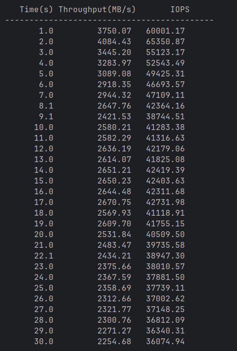
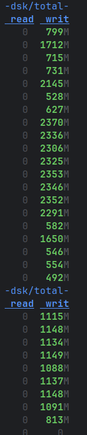
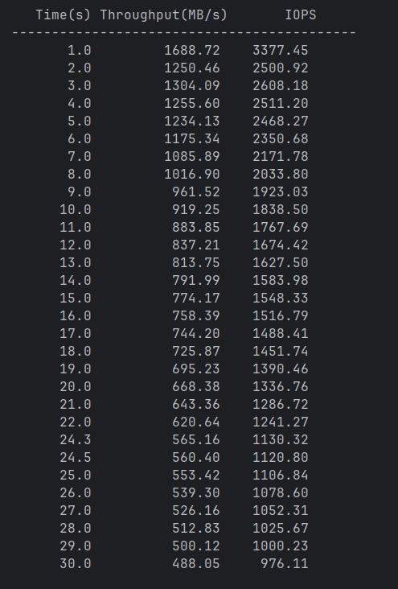
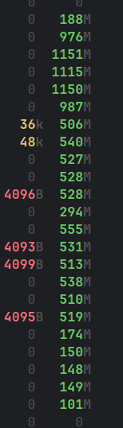
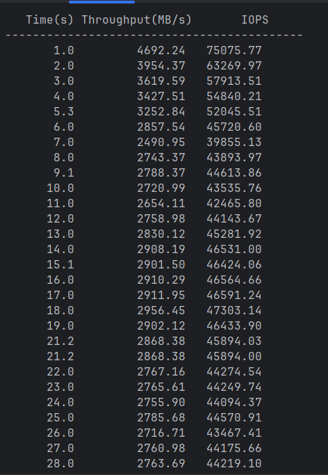
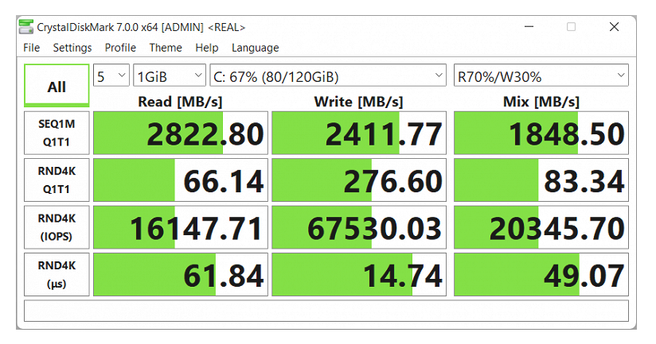

# Измерение скорости диска на запись

> Для сбора статистики использовал `dstat -d`

| Статистика | Вывод | Пояснение |
|--|--|--|
||| Я считаю, что это связано с буферизацией и внутренним кешированием в ядре и самом ssd|
||| При большом размере файла(32ГБ) и большом размере блока записи, процент попаданий в кеш снизился и расхождений стало меньше |
|| | Результаты +- сравнимы с тестом из [обзора](https://www.ixbt.com/mobilepc/huawei-matebook-d16-2022-review.html?ysclid=mgnkpc30c9732369463) на мой ноутбук|

Но к сожалению, побороть кеширование без его отключения напрямую я так и не смог. Насколько мне известно это одна из проблем моей ОС. Хотя проблемой включенное и работающее кеширование я бы не назвал)