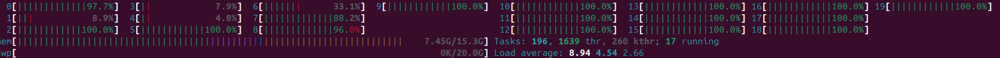

# Разложение числа на простые множители в качестве нагрузки

> Для мониторинга использовал htop
> Для переключений контекста pidstat -w -p <PID> 1

## Запуски
### Первый запуск

> ./factor 9223372036854775783 2147483647 true

Поскольку это число очень близко к максимальному и еще и является простым, то программа будет выполняться долго.
У процесса максимальный приоритет - 20. Кроме, того, это чистая cpu-нагрузка, поэтому он не выполняет добровольных переключений контекста.

В среднем за 13-ую минуту выполнения он выполнял 0 и 25.19 вынужденных и невынужденных переключений контекста соответственно. Это только подтверждает мои слова
> Для получения переключений контекста использовал pidstat -w -p PID 1 

Кроме того в среднем, процесс стабильно занимал 100% ЦПУ, но на 17 минуте,система разделила его на 3 ядра. Потребление CPU из-за этого выросло на процент
Но при всем вышесказанном %USER мал (5%), а %IDLE наоборот высокий (93%). Поэтому для эффективной нагрузки системы необходимо распарралелить нагрузчик.

### Второй запуск

> ./factor 9223372036854775783 2147483647 true -t 4

Запуск в 4 потока. Каждый поток по прежнему потребляет 100% CPU, но ОС распарралелила их на 5-6 потоков
%USR вырос до 21,5%, %IDLE упал до 77.54 процентов. В системе все еще слишком мало RUNNABLE

### Третий запуск

> ./factor 9223372036854775783 2147483647 true -t 16

В моем ПК кол-во ядер - 20. Поэтому для остальных процессов оставил 4 ядра.

%USR - 83,17, %IDLE - 15.35.
Количество вынужденных переключеник контекста составляет +- 3 / процесс

### Четвертый запуск

> ./factor 9223372036854775783 2147483647 true -t 20

Запустил на всея ядрах.
%USR - 99, %IDLE - 0.03, %SYS - 1
Количество вынужденных переключеник контекста составляет +- 50 / процесс

### Четвертый запуск

> ./factor 9223372036854775783 2147483647 true -t 20

Запустил на всея ядрах.
%USR - 99, %IDLE - 0.03, %SYS - 1
Количество вынужденных переключеник контекста составляет +- 80 / процесс

### Четвертый запуск

> ./factor 9223372036854775783 2147483647 true -t 40

%USR - 99, %IDLE - 0, %SYS - 1
Количество вынужденных переключеник контекста составляет +- 100 / процесс

### Пятый запуск

> ./factor 9223372036854775783 2147483647 true -t 20

Собрал файл с включенными оптимизациями компилятора
Глобально ничего не изменилось

### Шестой запуск

> ./factor 9223372036854775783 2147483647 true -t 10
> ./disk-thpt-write -d 300 -t 10

Запустил парралельно оба нагрузчика
Теперь
* %USR - 52.71
* %SYS - 5
* %IOWAIT - 18
* %IDLE - 23.8

